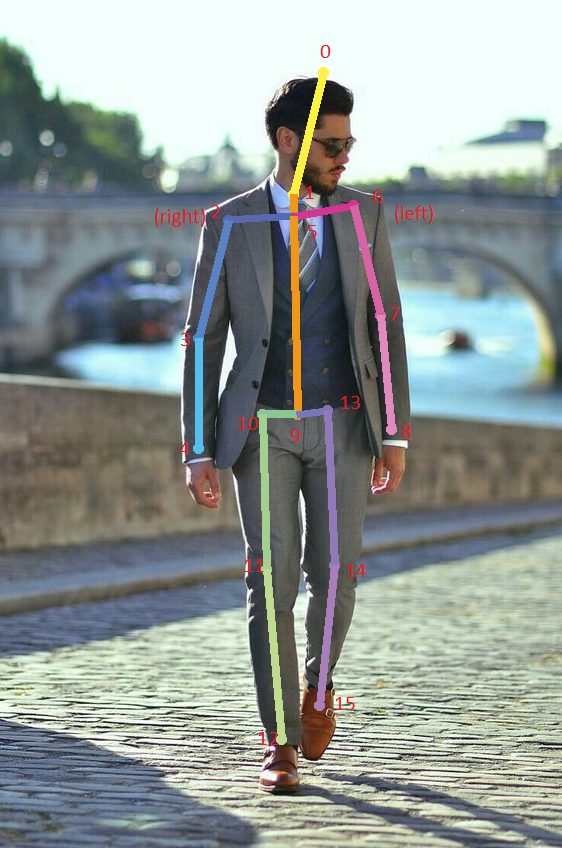

<font size= "5"> **Table Of Contents** </font>
- [Introduction](#introduction)
- [Demo](#demo)
- [Setting enviroment](#setting-enviroment)
  - [With env tool](#with-env-tool)
    - [Creating a virtual enviroment](#creating-a-virtual-enviroment)
    - [Activating the virtual env](#activating-the-virtual-env)
    - [Leaving the virtual env](#leaving-the-virtual-env)
    - [How to use TensorRT python package in a virtual env?](#how-to-use-tensorrt-python-package-in-a-virtual-env)
    - [How to install pytorch for jetson?](#how-to-install-pytorch-for-jetson)
    - [How to install tensorflow for jetson?](#how-to-install-tensorflow-for-jetson)
- [Preparation](#preparation)
  - [Yolov5 custom model for human detection](#yolov5-custom-model-for-human-detection)
  - [Converting model to run on tensorrt](#converting-model-to-run-on-tensorrt)
  - [Convert variant models of Efficient Pose to infer on tensorrt](#convert-variant-models-of-efficient-pose-to-infer-on-tensorrt)
- [Some common errors when running on jetson devices](#some-common-errors-when-running-on-jetson-devices)
- [Note](#note)


# Introduction
This project was created to deal with the problem of detecting fare evasion through turnstiles in public areas such as subway stations, airports, etc. This repo is implemented by python.
# Demo

<p align= "center">


</p>

# Setting enviroment
- Install pip for ubuntu:
```
sudo apt install python3-pip
```
## With env tool 
- install env tool
```
sudo apt install python3-venv
```

### Creating a virtual enviroment
```
cd ~/
python3 -m venv tjd_tx2
```
### Activating the virtual env
```
source ~/tjd_tx2/bin/activate
export PYTHONPATH=/usr/lib/python3.6/dist-packages:$PYTHONPATH
export LD_PRELOAD=/usr/lib/aarch64-linux-gnu/libgomp.so.1
```
### Leaving the virtual env
```
deactivate
```
### How to use TensorRT python package in a virtual env?

- TensorRT Pyton module was not installed. Setting up TensorRT on Jetson Nano as described here:
[A Guide to using TensorRT on the Nvidia Jetson Nano - Donkey Car](https://docs.donkeycar.com/guide/robot_sbc/tensorrt_jetson_nano/)

- Installing pycuda:
```
(tensorflow-demo) nvidia@nvidia-nano:/usr/src/tensorrt/samples/python$ pip install pycuda
Collecting pycuda
  Using cached https://files.pythonhosted.org/packages/5e/3f/5658c38579b41866ba21ee1b5020b8225cec86fe717e4b1c5c972de0a33c/pycuda-2019.1.2.tar.gz
Requirement already satisfied: pytools>=2011.2 in /home/nvidia/python-envs/tensorflow-demo/lib/python3.6/site-packages (from pycuda) (2019.1.1)
Requirement already satisfied: decorator>=3.2.0 in /home/nvidia/python-envs/tensorflow-demo/lib/python3.6/site-packages (from pycuda) (4.4.1)
Requirement already satisfied: appdirs>=1.4.0 in /home/nvidia/python-envs/tensorflow-demo/lib/python3.6/site-packages (from pycuda) (1.4.3)
Requirement already satisfied: mako in /home/nvidia/python-envs/tensorflow-demo/lib/python3.6/site-packages (from pycuda) (1.1.0)
Requirement already satisfied: six>=1.8.0 in /home/nvidia/python-envs/tensorflow-demo/lib/python3.6/site-packages (from pytools>=2011.2->pycuda) (1.13.0)
Requirement already satisfied: numpy>=1.6.0 in /home/nvidia/python-envs/tensorflow-demo/lib/python3.6/site-packages (from pytools>=2011.2->pycuda) (1.17.4)
Requirement already satisfied: MarkupSafe>=0.9.2 in /home/nvidia/python-envs/tensorflow-demo/lib/python3.6/site-packages (from mako->pycuda) (1.1.1)
Building wheels for collected packages: pycuda
  Building wheel for pycuda (setup.py) ... done
  Created wheel for pycuda: filename=pycuda-2019.1.2-cp36-cp36m-linux_aarch64.whl size=4497309 sha256=e7bbecd3bfa86a84f2ed505966a51123d97073cb4fd981ed434959f20a7507f3
  Stored in directory: /home/nvidia/.cache/pip/wheels/a6/60/f0/b1c430c73d281ac3e46070480db50f7907364eb6f6d3188396
Successfully built pycuda
Installing collected packages: pycuda
Successfully installed pycuda-2019.1.2
```
- Let's see where is now pycuda:
```
nvidia@nvidia-nano:~$ sudo find / -name *pycuda*
find: ‘/run/user/1000/gvfs’: Permission denied
find: ‘/run/user/120/gvfs’: Permission denied
/home/nvidia/.cache/pip/wheels/a6/60/f0/b1c430c73d281ac3e46070480db50f7907364eb6f6d3188396/pycuda-2019.1.2-cp36-cp36m-linux_aarch64.whl
/home/nvidia/python-envs/tensorflow-demo/lib/python3.6/site-packages/pycuda-2019.1.2.dist-info
/home/nvidia/python-envs/tensorflow-demo/lib/python3.6/site-packages/pycuda
/home/nvidia/python-envs/tensorflow-demo/lib/python3.6/site-packages/pycuda/cuda/pycuda-helpers.hpp
/home/nvidia/python-envs/tensorflow-demo/lib/python3.6/site-packages/pycuda/cuda/pycuda-complex.hpp
/home/nvidia/python-envs/tensorflow-demo/lib/python3.6/site-packages/pycuda/cuda/pycuda-complex-impl.hpp
```
- Let's find TensorRT:
```
nvidia@nvidia-nano:~$ ls -la /usr/lib/python3.6/dist-packages
total 4272
drwxrwxr-x 10 root root    4096 Nov 28 22:43 .
drwxr-xr-x 33 root root   20480 Dec  7 23:46 ..
-rw-r--r--  1 root root 2831864 Feb  6  2019 cv2.cpython-36m-aarch64-linux-gnu.so
drwxr-xr-x  2 root root    4096 Aug 16 19:52 graphsurgeon
drwxr-xr-x  2 root root    4096 Aug 16 19:52 graphsurgeon-0.4.1.dist-info
drwxr-xr-x  4 root root    4096 Nov 28 22:43 jetson
drwxr-xr-x  4 root root    4096 Nov 28 22:43 Jetson
-rw-r--r--  1 root root  746496 Nov 28 22:43 jetson_inference_python.so
-rw-r--r--  1 root root  725512 Nov 28 22:43 jetson_utils_python.so
drwxr-xr-x  3 root root    4096 Aug 16 19:52 tensorrt
drwxr-xr-x  2 root root    4096 Aug 16 19:52 tensorrt-5.1.6.1.dist-info
drwxr-xr-x  5 root root    4096 Aug 16 19:52 uff
drwxr-xr-x  2 root root    4096 Aug 16 19:52 uff-0.6.3.dist-info
```
```
nvidia@nvidia-nano:~$ ls -la /usr/lib/python3.6/dist-packages/tensorrt
total 2156
drwxr-xr-x  3 root root    4096 Aug 16 19:52 .
drwxrwxr-x 10 root root    4096 Nov 28 22:43 ..
-rw-r--r--  1 root root    2914 Jun  4  2019 __init__.py
drwxr-xr-x  6 root root    4096 Aug 16 19:52 legacy
-rw-r--r--  1 root root 2190376 Jun  4  2019 tensorrt.so
```

- TensorRT is still not visible to Python in virtual environment though:
```
(tensorflow-demo) nvidia@nvidia-nano:/usr/src/tensorrt/samples/python$ python -c "import tensorrt as trt"
Traceback (most recent call last):
  File "<string>", line 1, in <module>
ModuleNotFoundError: No module named 'tensorrt'
```
- We need to add the path to TensorRT package to PYTHONPATH in virtual environment:
```
(tensorflow-demo) nvidia@nvidia-nano:/usr/src/tensorrt/samples/python$ export PYTHONPATH=/usr/lib/python3.6/dist-packages:$PYTHONPATH
```
- TensorRT is now visible to Python:
```
(tensorflow-demo) nvidia@nvidia-nano:/usr/src/tensorrt/samples/python$ python -c "import tensorrt as trt"
``` 
### How to install pytorch for jetson?
- Refer: [pytorch-for-jetson-version-1-10-now-available](https://forums.developer.nvidia.com/t/pytorch-for-jetson-version-1-10-now-available/72048)
### How to install tensorflow for jetson?
- Refer: [install-tf-jetson-platform](https://docs.nvidia.com/deeplearning/frameworks/install-tf-jetson-platform/index.html#install)

# Preparation
## Yolov5 custom model for human detection
## Converting model to run on tensorrt
- Refer: [wang-xinyu/tensorrtx](https://github.com/wang-xinyu/tensorrtx/tree/master/yolov5)

## Convert variant models of Efficient Pose to infer on tensorrt
- run the following command as : 
```
python3 builds/efficient_pose/buildEngine.py --onnx_file [onnx_file_path] --plan_file [plan_file_path]
#Sample: python3 builds/efficient_pose/buildEngine.py --onnx_file /home/thaivu169/Projects/Turnstiles_Fare_Evasion_Python/models/efficient_pose/onnx/EfficientPoseI.onnx --plan_file /home/thaivu169/Projects/Turnstiles_Fare_Evasion_Python/plugins/efficient_pose/jetson_TX2/EfficientPoseI.plan
```

# Some common errors when running on jetson devices
- OSError: /usr/lib/aarch64-linux-gnu/libgomp.so.1: cannot allocate memory in static TLS block
```
# Solution:
export LD_PRELOAD=/usr/lib/aarch64-linux-gnu/libgomp.so.1
```
- OSError: Failed to load library from libmediainfo.so.0 - libmediainfo.so.0: cannot open shared object file: No such file or directory 
```
# Solution:
sudo apt-get update -y
sudo apt-get install -y libmediainfo-dev
```

# Note
- To list all video devices picked up by the kernel
```
ls -ltrh /dev/video*
```
- ffprobe is reporting the actual width x height. Width is displayed first, then height (no matter the order you request it). Your player is using the rotate metadata or the displaymatrix side data and rotating upon playback.
```
ffprobe -v error -select_streams v:0 -show_entries stream=width,height:stream_tags=rotate -of csv=p=0 input.mp4
```
- Graph and session of tensorflow (from v1):
```
Refer: https://danijar.com/what-is-a-tensorflow-session/
```
- Where is trtexec?
```
Refer: https://forums.developer.nvidia.com/t/where-is-trtexec/73514
```  
_If TensorRT is installed manually, I believe you can find the code to build trtexec in /usr/src/tensorrt/samples/trtexec/ where you can run make to build it._
- Keypoints of the EfficientPose model:
<p align= "center">

</p>